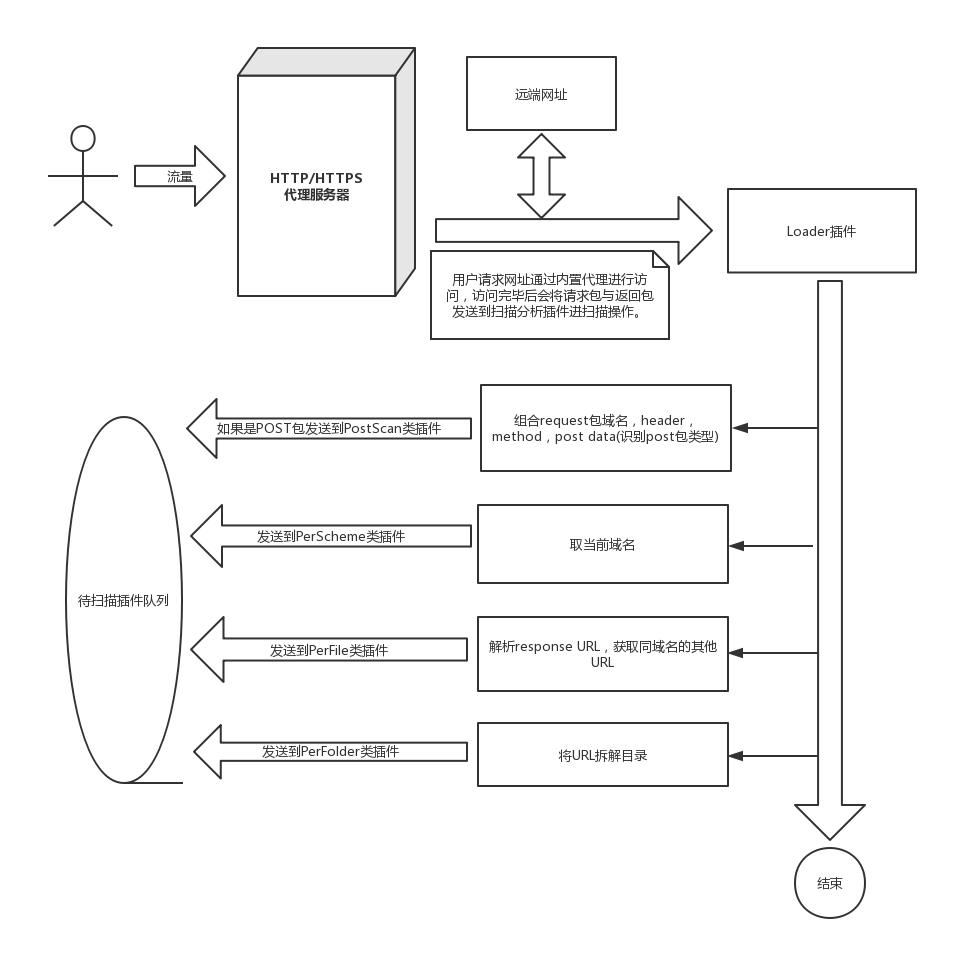

# w13scan
长亭的xray挺不错的，可惜没有开源，而且很多地方我都有不同的想法，网络上开源的被动扫描器都不够好，所以造此轮子。

## 简介
w13scan是一款插件化基于流量分析的扫描器，通过编写插件它会从访问流量中自动扫描，基于Python3。

- 支持 Windows/Linux/Mac
- pip一键安装

## Https支持
设置代理服务器(默认127.0.0.1:7778)后，访问`http://w13scan.ca`下载根证书并信任它。

## 相关配置
`config.py`保存了扫描器使用的各种配置，按照注释修改即可。

## 检测插件

- PerFile (每个文件 )
    - [x] 序列化参数分析
    - [x] asp代码执行
    - [x] php代码执行
    - [x] 系统命令执行
    - [x] cors检测
    - [x] 目录穿越
    - [x] 模板表达式注入
    - [x] js敏感文件探测
    - [x] jsonp探测
    - [x] 通用敏感文件探测
    - [x] php真实路径检测
    - [x] 重定向插件
    - [x] sql注入 (布尔盲注，基于报错，基于时间)
    - [x] 被动子域名搜索
    - [x] xpath 注入
    - [x] xss注入
    - [x] crlf注入
    - [x] cookie控制插件
- PerFolder (每个目录)
    - [x] 基于目录备份文件扫描
    - [x] 目录遍历
    - [x] 敏感文件扫描
    - [x] .idea 工作目录解析
    - [x] phpinfo探测解析
    - [x] git svn bzr hg泄漏
    - [x] Sftp探测
    - [x] WEB编辑器探测
- PerScheme (每个域名)
    - [x] 基于域名备份文件
    - [x] Linux通用敏感文件扫描
    - [x] 目录穿越扫描
    - [x] dz xss探测
    - [x] 错误页面信息泄漏
    - [x] flash xss探测
    - [x] iis解析漏洞
    - [x] java web目录探测
    - [x] 敏感目录探测
    - [x] wordpress 备份文件
- PostScan (支持POST插件)
    - [x] php代码执行
    - [x] 命令执行
    - [x] 目录穿越
    - [x] sql 基于布尔类型注入
    - [x] sql 报错注入
    - [x] sql 时间注入
    - [x] xss 注入

## Thx
- [贡献者列表](CONTRIBUTORS.md)

## 法律
本程序仅用于学习交流,在使用之前请遵守当地相关法律进行，切勿用于非法用途。

# w13scan 设计思路
吸取w12scan的教训，w12scan写到后面就懒得写自己的思路了，而且设计这种东西每天都不一样，有时候写了篇文章，第二天把架构又换了。为防止这种情况发生，所以记载将以时间顺序，也当作日记来看吧，也可以让大家明白，我为什么这么做。

- 2019.6.28 周五  自从又了w13scan的想法后，想了一周的如何设计，看到开源的`https://github.com/qiyeboy/BaseProxy`，太好了，这就是我需要的代理框架。然后在它基础上做了些符合我设计的调整。用xray的时候访问外网会非常的卡,所以我设想的是代理框架在返回给浏览器的时候再来调用插件而不是在截获请求的时候就调用,代理访问和插件扫描是分离开的。

- 2019.6.29 周六  初步制定了插件化的调用框架，插件结构，整个代码结构模仿pocsuite3。插件可以从返回的源码中获取链接用于组合payload。完善了整个框架，编写了一些测试插件，0.1版本发布🎉🎉,因为插件架构的原因，每个插件中发送的请求要尽可能少，因为每个插件只开一个线程运行，当插件中请求较多时，会比较慢，所以对插件要求粒度拆分更细。增加了几个简单的扫描插件，基于当前返回的网页源码以及从流量分析中获取的目录作为扫描payload。

- 2019.6.30 周日  在健壮了框架的一些功能后，开始编写SQL注入插件，首先得实现一个网页相似度对比算法，SQL注入中很多网页的比对都要基于该算法，在`w3af`中找到了该算法，这个算法挺特别的，它不是基于dom树，它根据一些特殊的标签`<'"`来分隔文本在进行比较，比基于dom树简单但效果挺好～太厉害了,sqlmap的是基于单词的对比，会去掉所有网页元素，也集成上来了，不过效果不太理想。抓取了xray的payload，将SQL注入插件（数字型，报错型，时间盲注型，布尔类型）都写完了，不过只完成了`GET`类型的SQL注入判断，`POST`类型看情况再加吧（主要没有靶机测试，不知道效果..）等插件多了，我想再将插件的调度流程优化一下，目前还是有些繁琐。还有一个框架的去重策略也不够好，准备继续优化。

- 2019.7.3 周三 这一周主要在思考对POST的支持和插件系统重构的思路，因为现在有很多琐碎重复的处理在每个插件中，重构后的插件系统希望把这些抽离出来。

  - 插件只做插件应该完成的事情就行，所以像那些参数处理之类的都由插件系统来提供统一接口进行调用。

  - 对POST的支持原本是比较容易，但当我看了sqlmap的处理后，觉得有点复杂了。在sqlmap的设计中，将post数据分为了下面几类

    - ```python
      class POST_HINT(object):
          NORMAL = "NORMAL"
          SOAP = "SOAP"
          JSON = "JSON"
          JSON_LIKE = "JSON-like"
          MULTIPART = "MULTIPART"
          XML = "XML (generic)"
          ARRAY_LIKE = "Array-like"
      ```

    - 而作为一款自动化软件，我需要对这些格式都进行解析，提供给插件系统，最后在对解析后的参数重新生成相应data，发送给目标，这将是一件长期的工作。

  - 去重策略：作为被动型的扫描器，去重策略也是很重要的点，我不能让同一个网站进行相同两次的扫描。初步设想是去重策略在插件系统完成，插件系统内部过滤完再发送给相应插件，为此有必要单独为它写一个类。

    - 去重的核心是把url解析获得`scheme`、`netloc`、`params`、`path`和对应`plugin`,数据结构如何排还没有想好，如何快速的查找重复和能够存储大量的数据是核心
  
- 2019.7.4 周四 加入了`命令注入`(php代码注入,asp代码注入，系统命令注入)模块。今天看了AWVS对参数的解析模块，除了一般的解析外，它还会判断参数是否是base64编码，是否是a Java serialized object,是否是PHP serialized object 或 base64+serialized的形式，Python serialized object, base64+serialized的形式，W13SCAN也准备加入这个功能。

- 2019.7.5 周五 仿照Awvs重新设计了插件了目录，类别以及流程图，应该能很直观的明白运行方式吧。
  
    - 
    - 值得注意的是此次架构改造完毕后，`W13SCAN`将不再是简单的被动扫描器了，它还会从返回包中自动寻找网址，进行同样的扫描操作。可以说它现在是`主动+被动`结合的扫描器了，当然，自动爬取可能会误触到`注销`之类的按钮，所以爬虫不会爬带logout之类的链接。
    - 今天一天都在重构插件框架，已经差不多了，但晚上要去看电影，估计今天是完不成了，今天完成了这些
        * [x] post包组合通用函数
        * [x] respos解析中request response组合
        * [x] 去重策略
        * [x] 插件改造
    - 明天又是一个周末，想搭个靶机测测具体效果～然后url通用解码函数和POST插件的编写。

- 2019.7.6 周六 又是一个平常的周末，将现有的模块在靶机上测试，至少插件已经优化好了可以在靶机上扫描到目标,继续扒awvs上的规则丰富插件,新增一个jsonp插件,cors插件和错误页面信息寻找插件。

- 2019.7.7 周日 第一次尝试用W13SCAN挖洞，想随便扫一扫试试效果，挺打击的，得到的不是漏洞信息而是一大片红色的报错，还无从找起原因。啊，这些神奇的bug啊，这些可恶的bug啊。经过多次测试，数字型sql注入没必要单独写一个插件，合并到了布尔类型sql注入插件中。今天完成一些POST请求的插件,还有一些小问题，post注入时也要对url的参数进行分析扫描，现在是没有完成的。
    * [x] POST插件 PHP代码注入
    * [x] POST插件 系统命令注入
    * [x] POST插件 SQL布尔盲注、报错注入、时间盲注
    - 扫描插件已经完成了一大部分，但是究竟扫描效果如何呢，我不知道，我还没有验证过，或许应该找两个SRC刷刷看？有时候想法很多，但能做好一个就不错了。
    - 用W13SCAN发现的第一个漏洞 [https://x.hacking8.com/post-350.html](https://x.hacking8.com/post-350.html)
    
- 2019.7.8 周一 加入目录穿越插件,血泪史：如果同一个字典在多线程中`items()`遍历，会报`Runtime Error`，调试了好久才发现。改造了`requests`，使其可以返回请求包输出到控制台中。更新版本到0.2🎉🎉

- 2019.7.9 周二，找了个`zzzphp`准备本地跑一下试试效果，因为看它漏洞挺多的，天天有人发分析，就拿来练练手。一开始和往常一样，一大片红色的报错和0个漏洞，后来慢慢地把error屏蔽掉，后来手工找了个`目录穿越`的漏洞，发现竟没扫出来，加入了适配性的payload，就ok了，后面测试还找到了几个SQL注入，还把网站配置给插坏了，因为网站坏了，SQL注入还没来得及验证。挂着的时候还找到了一个`lastpass.com`的SQL注入，激动了一下，调试半天，结果发现是假的，气死了😡。
- 2019.7.10 周三，今天在测试时发现去重逻辑也是一个很大的问题，之前的去重逻辑是(域名+路径+参数key+插件)拼接的md5值，但是像一些框架，会有c代表控制器，a代表函数，以这个去重逻辑将会导致这类框架都扫描不到,所以现在的去重逻辑是整个url都做hash，虽然会让请求变多，但总比没有要好吧。同时支持在代理中在套一层代理，比如可以将扫描器的流量转发到`BurpSuite`,方便找到漏洞之后进行下一步调试。
- 2019.7.11 周四，今天应急了`Discuz!ML`的命令注入，发现插件还不支持对cookie进行扫描，先加上了SQL报错注入和PHP命令执行的cookie支持，SQL布尔注入和延时注入误报很大，需要进一步优化完再加上。今天同时也启发了我，未来漏洞应急时在多看一眼w13scan能否扫描到，能否对应添加一些通用payload（或者现在我就开始看之前的漏洞应急）？我相信这样积累一段时间就会变得更强的，哈哈。新增一个phpinfo搜索和利用的插件，计划在发现漏洞时显示更多信息，例如是通过哪几步payload得到的，什么方式对比的。
- 2019.7.12 周五，将level1等级完善，level1等级不会发出任何请求，只会从返回包中进行分析，适合有各种waf的场景，加入了备份文件扫描插件，通过读取压缩包前几位来判断。不知怎么的，最近布尔注入的误报越来越高，于是将算法换成了类似sqlmap的算法(因为只能看个大概懂)，测试了下效果还可以,只写了GET的，POST的等全面测试完善了再更新吧。
- 2019.7.14 周日，遇到一个神奇bug，debug模式下还复现不了，得把所有插件全开才能复现，debug的很痛苦，最后发现是由于本地mysql连接失败被sql报错注入抓到了...后面又接天连地发现无穷多bug，😭改不动了。。晚上把sqlmap源码又看了一次，这次把布尔盲注优化好了，照搬了sqlmap的算法，动态去除网页杂质还没有靶机测试，暂未添加。
- 2019.7.15 周一，一种神奇的感觉，将误报都消除后，再次测试，控制台再也没有显示误报了，突然有点失落的感觉，是扫描器自己不会爆漏洞，还是我控制了它不让它爆？
- 2019.7.16 周二，完善基于时间的SQL注入，多重判断解决误报,加入xpath检测模块。
- 2019.7.18 周四，w13scan发现的第二个漏洞 [https://x.hacking8.com/post-351.html](https://x.hacking8.com/post-351.html)
- 2019.7.20 周六，这两天给`w13scan`编写了一个主动引擎，想用于测试插件效果，但是批量测试的效果并不理想，想去刷刷SRC，结果都有防火墙。这两天脑子里还设计了一个关于`安全渗透测试平台`的遐想，但是过于庞大，可能也没有精力去实现了。这几天w13scan遇到了瓶颈，可能是想的太多，做的太少吧。整理了一些问题，列一些计划，慢慢来完成。

    * [x] 集成`bbscan`的敏感信息收集功能
    * [ ] 对POST参数，数组参数的支持
    * [ ] POST插件的完善
    * [x] 主动引擎 && 批量fuzz时间的优化
    * [x] 一些FUZZ插件的编写
    * [x] 对命令行的支持，控制台的颜色等等. **优先**
    * [x] 终端进度条显示结果个数
    * [ ] URL去重算法对时间参数的过滤
    * [x] 插件支持威胁等级，方便生成报告,~~插件修改为英文描述~~ **优先**
    * [ ] ~~扫描模块修改为多进程方式~~
    * [x] loader模块对cookie的支持
    * [ ] XXE漏洞
    * [x] 封装成Python模块，支持pip一键安装，开放API接口 **优先**
- 2019.7.26 周五，上周列了一些计划，完成了一半，将w13scan做成了Python模块的形式，使用`pip install w13scan`即可一键安装，接着输入命令`w13scan`即可运行扫描器,版本更新到`0.9`。未来会暴露API，通过引入w13scan库便可以快速编写一个扫描器！

    * [x] 内置一个证书，不用每次安装都要下载证书
    * [x] 解决httpserver退出时的报错

- 2019.7.27 周六，完成英文README.MD,完成W13SCAN API
- 2019.8.4 周日，解决两个体验的问题，第一个在Windows下进度条是一行一行输出的，在Mac下输出很好，我将输出长度-1后解决了，第二个是代理线程阻塞的问题，即使程序退出，还是会卡很久，Google了很久也没有答案，今天跟了一下代码，发现是代理线程没有设置daemon,所以基于该代理类设置了一下就ok了，很早就发现这问题了，但是一直没有解决，今天完美解决了，很高兴！
- 2019.8.6 优化若干效率问题,css,jpg等后缀的文件将不会加入扫描,新增加crlf扫描插件，cookie控制的值在页面显示插件。
  
    * [x] todo:自动检测语言，并使用对应payload
- 2019.8.7 周三：一个普通的星期三。 
- 2019.8.8 周四，添加 通过header头等信息来识别对应语言，操作系统，webserver等信息，方便插件选择payload,同时加入了wappalyzer信息探测模块，用于简单的信息收集。修复一处sql报错注入的异常。`0.9.5`版本发布。
- 2019.8.12 周一，加入了bug自动报告机制，0.9.6发布～
- 2019.8.14 周三，Xray今天推出了基于语义的xss检测，看起来很厉害，我也准备实现一套类似的方案，今天加入了简单的dom xss辅助插件。
- 2019.8.15 周四，迎来了bug报告机制发布以来的第一个bug报告～迅速修复了～
- 2019.8.17 周六，修复了多个反馈的bug，无意间发现了一个emlog的xss，嘻嘻，说明xss插件初显成效。基于语义的还在研究👀。
    ```python
    [XSS多种方式探测]                                                                     
    url            http://emlog.demo/admin/admin_log.php?pid=draft                  
    payload        pid:draft<2Fel>9402</2Fel>                                       
    descript       探测tag被解析                                                         
    type           html xss                                                         
                                                                                    
    #0 请求包                                                                          
    GET http://emlog.demo/admin/admin_log.php?pid=draft&pid=draft%3C2Fel%3E9402%3C%2
    F2Fel%3E                                                                        
    user-agent: Mozilla/5.0 (Macintosh; Intel Mac OS X 10_14_6) AppleWebKit/537.36 (
    KHTML, like Gecko) Chrome/76.0.3809.100 Safari/537.36                           
    accept-encoding: gzip, deflate                                                  
    accept: text/html,application/xhtml+xml,application/xml;q=0.9,image/webp,image/a
    png,*/*;q=0.8,application/signed-exchange;v=b3                                  
    Connection: close                                                               
    host: emlog.demo                                                                
    proxy-connection: keep-alive                                                    
    pragma: no-cache                                                                
    cache-control: no-cache                                                         
    upgrade-insecure-requests: 1                                                    
    referer: http://emlog.demo/admin/                                               
    accept-language: zh-CN,zh;q=0.9,en;q=0.8
    ```

- 2019.8.21 周三，合并了由@[Go0p](https://github.com/Go0p) 提交的struts漏洞套餐，我意识到添加些框架类的检测插件将会使w13scan更强，同时插件的分级制度也刻不容缓了，按照等级运行相关插件，现在是一股脑的全上，遇到小站或waf就蒙了。还在研究基于js语义的xss检测插件，解析出来的语法树操作起来太难了，还要考虑针对的各种情况，难怪有这个设想的很多，但是现成的例子很少，如果我做出来了，将会是第一个吧？
- 2019.8.26 周一，很多bug report报告的都是`request`的各种奇葩报错，如何优雅的调用request真是一个问题。今天遇到的一个编码解析问题,网上搜索了一下，报错原因 <http://www.vuln.cn/8691>，但是修复方案太粗暴了，准备先向request提个pr，如果不采纳，在尝试自己用hook解决。
- 2019.8.28 周三，奇了怪了，编码问题硬是复现不出来。。所以在hook request的时候都先编码再解码，这样最保险了。引入bug report后，issue的数量明显增多的（虽然都是@sqlmapreport报告的），但是在多次测试时发现插件还是需要优化的，但是又发现了一个burp awesome项目，将别人为burp写的插件集成到w13scan中我觉得不错，那么问题来了，到底是先优化插件呢还是添加插件呢。这是个问题。
- 2919.8.31 周六 [写在w13scan第一阶段.md](https://x.hacking8.com/post-356.html) 
- 2019.9.4  周三，使用simhash算法优化了去重处理，版本更新到0.9.13
- 2019.9.7  周六，优化了SQL注入相关的算法，报错注入的正则用的是w3af，但是规则太宽泛误报很多，修改了一些规则。SQL布尔盲注仅通过一次验证误报也有点高，加入了二次验证，同时完成了动态内容替换算法，在计算相似度时将更精确了。基于JS语法分析的DOM-XSS扫描器已经完成了大半(大的框架已经确定剩下就是些规则的查漏补缺了)，将在一些实战环境上测试下效果，嘿嘿😁
- 2019.9.8  周日，今天研究了一下http走私攻击(smuggling)，准备给w13scan加上此功能，在[https://portswigger.net/web-security/request-smuggling](https://portswigger.net/web-security/request-smuggling)写的很详细了，还提供了开源的检测程序，太良心了！但是将它转换为自己的插件，还有一段路要走。
    - 首先是网络请求包该如何包，说真的有点后悔用requests了，给human考虑的太周全了,在之前写sqlmap chunked发包时也了解到了Python底层库httplib也不提供`chunked`的支持，所以准备参考[hack-requests](https://github.com/boy-hack/hack-requests)用更底层的原生库实现一下。
    - portswigger将这种攻击分为了三种类型，需要一一实现，但是它的开源程序里只实现了前两次
    - 考虑到并不是每个网站都能实施该攻击，所以要有一个简单的判断来判定是否适合实施该攻击。
    - 因为这是网站的架构环境的问题，所以检测到一次后就可以住手了，不需要多余的使用。
    - 突然感觉这样还有点不适合被动扫描了？
